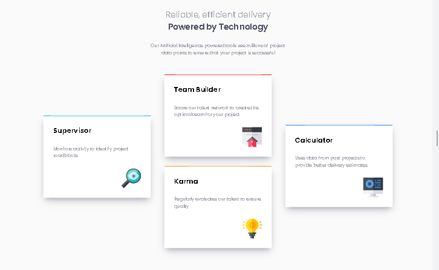

# Frontend Mentor - Four card feature section solution

This is a solution to the [Four card feature section challenge on Frontend Mentor](https://www.frontendmentor.io/challenges/four-card-feature-section-weK1eFYK). Frontend Mentor challenges help you improve your coding skills by building realistic projects. 

## Table of contents

- [Overview](#overview)
  - [The challenge](#the-challenge)
  - [Screenshot](#screenshot)
  - [Links](#links)
- [My process](#my-process)
  - [Built with](#built-with)

## Overview

### The challenge

Users should be able to:

- View the optimal layout for the site depending on their device's screen size

### Screenshot

### Links

- [Solution URL]([https://your-solution-url.com](https://www.frontendmentor.io/solutions/responsive-four-card-feature-section-solution-using-grid-Rqz9moNhhL))
- [Live Site URL]([https://your-live-site-url.com](https://husamasaad.github.io/Four-card-feature-section/))

## My process

### Built with

- Semantic HTML5 markup
- CSS Grid
- Mobile-first workflow

## Author

- Frontend Mentor - [@husamasaad](https://www.frontendmentor.io/profile/husamasaad)

